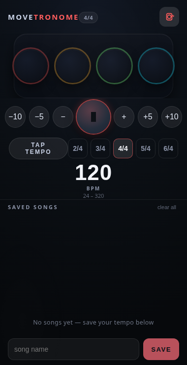

# MOVETRONOME

A mobile-first, single-page visual metronome. The whole screen flashes in
color on every beat, a row of big circles tracks each beat of the measure,
and your saved song tempos are one tap away.

## Features

- Full-screen colour flash on every beat — the downbeat flashes strongest
- One circle per beat, each with its own consistent colour
- BPM control: −10 / −5 / −1 / +1 / +5 / +10, tap-tempo, or type it in
- Save song names with their tempo to a persistent list (`localStorage`)
- Time signatures 2/4 – 6/4
- Tick sound synthesized with WebAudio — no audio files, no network; mute persists
- No dependencies, no server — just open `index.html`

## Usage

Open `index.html` in a browser (works great on a phone). Tap the play
button, load a saved song from the list to jump to its tempo, or save the
current tempo with a name.

## License

Public domain — released under the [Unlicense](LICENSE).